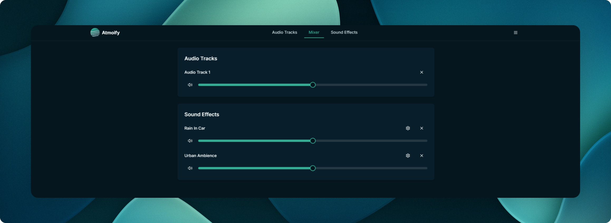

# Atmoify

Atmoify is a web application that allows users to create their perfect atmospheric environment for working, studying, or relaxing. It combines audio tracks, ambient sound effects, and focus/sleep timers to enhance productivity and relaxation.



## Features

- Add YouTube audio tracks
- Toggle various ambient sound effects
- Mix and adjust volumes for all audio sources
- Set focus and sleep timers
- Save and load custom sound profiles

---

## Running the Application

### Prerequisites

- Docker
- Docker Compose

### Instructions

1. Create a `compose.yaml` file with the following content:

```yaml
version: '3.9'

services:
  app:
    image: ghcr.io/bluegoosemedia/atmoify
    ports:
      - "3000:3000"
    environment:
      - NODE_ENV=production
```

2. Run `docker-compose up -d` to start the container.